# 🏨 Hotel No-Show Prediction Pipeline

Hello! Welcome to my project repository for the **Hotel No-Show Prediction** technical assessment. 

In the hospitality industry, when a guest makes a reservation but does not arrive (a **"no-show"**), it leads to significant revenue losses and inefficient room allocations. This project establishes a complete, production-grade Machine Learning (ML) pipeline that ingests raw SQLite customer data, handles advanced cleaning and intelligent imputation, builds a predictive model, and exposes it as a real-time web service.

---

## 📊 Pipeline Architecture & Data Flow

Here is a visual map showing exactly how data flows from the raw SQLite database through my feature engineering and preprocessing steps, all the way to model training and the live FastAPI deployment:

```mermaid
graph TD
    %% Base styling
    classDef default fill:#f8f9fa,stroke:#343a40,stroke-width:1px,color:#212529;
    classDef database fill:#e8f0fe,stroke:#1a73e8,stroke-width:2px,color:#1967d2;
    classDef step fill:#e6f4ea,stroke:#137333,stroke-width:2px,color:#137333;
    classDef model fill:#fef7e0,stroke:#b06000,stroke-width:2px,color:#b06000;
    classDef deploy fill:#fce8e6,stroke:#c5221f,stroke-width:2px,color:#a50e0e;

    subgraph Data Ingestion
        A[(SQLite: noshow.db)]:::database -->|ingest_data| B[Raw DataFrame]
    end

    subgraph Data Cleaning & Imputation
        B -->|clean_data| C[Cleaned DataFrame]:::step
        C -->|1. Remove Null Targets| C1[Drop null no_show]
        C1 -->|2. Casing Correction| C2[Standardize Month Casing]
        C2 -->|3. Negative Days Correction| C3[Absolute Day Numbers]
        C3 -->|4. Text Guest Mapping| C4[Integer Guest Counts]
        C4 -->|5. Normalize Price| C5[Unified Price to SGD via 1.37 Rate]
        C5 -->|6. Impute Missing Rooms| C6[KNN Classifier Imputer]
        C6 -->|7. Impute Missing Prices| C7[Random Forest Regressor Imputer]
    end

    subgraph Feature Engineering
        C7 -->|generate_features| D[Featured DataFrame]:::step
        D -->|stay_duration| D1[Stay Duration in Days]
        D -->|lead_time_months| D2[Lead Time in Months]
    end

    subgraph Preprocessing & Leakage Control
        D2 & D1 -->|preprocess_data| E[Processed Arrays]:::step
        E -->|Stratification| E1[80/20 Train-Test Split]
        E1 -->|One-Hot Encoding| E2[branch, country, room]
        E1 -->|Robust Scaling| E3[price_sgd, stay_duration, lead_time_months]
    end

    subgraph Model Training & Serialization
        E2 & E3 -->|train_and_select_model| F[Candidate Models]:::model
        F -->|Candidate 1| F1[LightGBM]
        F -->|Candidate 2| F2[Random Forest]
        F -->|Candidate 3| F3[Logistic Regression]
        F1 & F2 & F3 -->|ROC-AUC Evaluation| G{Select Best Model}
        G -->|LightGBM| H[best_model.pkl]:::model
    end

    subgraph API Deployment
        H -->|FastAPI Integration| I[Swagger UI API Endpoint]:::deploy
        I -->|JSON Request Payload| J[predict.py Inference Engine]
        J -->|Probability Scores| K[Output: No-Show Prediction]
    end
```



---

## 🔍 Task 1 EDA Findings & Pipeline Choices

During my Exploratory Data Analysis (EDA) in Task 1, I uncovered several critical data anomalies and behavioral patterns in the raw dataset. To build a robust, high-performing machine learning pipeline, I directly translated these EDA insights into specific data cleaning steps and feature engineering choices. 

Here is an overview of my key findings and the corresponding choices I made in my pipeline:

### 1. Handling Missing Data (The Smart Imputation Strategy)
* **EDA Finding:** I discovered that over 20% of the bookings were missing their `room` type or `price` information. Simply dropping these rows would lose valuable training data, while filling them with simple statistics (like mean or median) would distort the price distribution and confuse the model.
* **Pipeline Choice:** 
  * I noticed that **room type is highly dependent on price and hotel branch** (e.g., Changi vs. Orchard). So, I trained a **K-Nearest Neighbors (KNN) Classifier** to impute missing room types based on price and branch.
  * I also found that **room type, branch, and guest demographics (adults/children) are strong predictors of the room price**. Thus, once room types were filled, I trained a **Random Forest Regressor** to predict and impute the missing prices. This keeps our data distributions natural and realistic!

### 2. Currency Inconsistencies (Price Standardization)
* **EDA Finding:** The raw `price` column was a mix of different currencies stored as text strings (e.g., some were listed as `"USD 120.00"` and others as `"SGD 150.00"`).
* **Pipeline Choice:** To feed prices into a machine learning model, they must be numerical and on the same scale. In my pipeline, I standardized all prices to a single currency (SGD) by parsing the strings and multiplying any USD amounts by the implied historical exchange rate of **1.37**.

### 3. Inconsistent Text and Typographical Anomalies
* **EDA Finding:** 
  * The `num_adults` column contained mixed data types, representing guest counts as both digits (`1`, `2`) and text strings (`"one"`, `"two"`).
  * Month columns (`booking_month`, `arrival_month`, `checkout_month`) had inconsistent letter casing (e.g., `"MaY"`, `"june"`, `"October"`).
  * Some day columns contained negative numbers (e.g., `-31` or `-15`).
* **Pipeline Choice:** I resolved these spelling and format inconsistencies during data cleaning to ensure standard input types:
  * I mapped text counts (`"one"`, `"two"`) to numerical digits (`1`, `2`).
  * I standardized all months to standard title case (e.g., `"May"`, `"June"`).
  * I applied absolute values (`abs()`) to all negative day values to restore them to valid positive calendar days.

### 4. High-Impact Feature Engineering
To help my machine learning model make better predictions, I created new features that capture customer behavior far better than the raw fields alone:
* **Feature 1: Stay Duration (`stay_duration`)**
  * *EDA Finding:* The raw data had separate arrival and checkout details, but not the actual length of the stay. In hospitality, guests staying longer might have a different commitment level than those staying for a single night.
  * *Pipeline Choice:* I engineered the `stay_duration` feature by calculating the difference between check-out and arrival days. I wrote custom logic to handle bookings that cross month boundaries (e.g., arriving June 30 and checking out July 2) by checking the maximum days of each month.
* **Feature 2: Lead Time in Months (`lead_time_months`)**
  * *EDA Finding:* A classic predictor in hotel no-shows is how far in advance a room is booked. Customers who book months in advance are statistically more likely to cancel or not show up compared to last-minute bookings.
  * *Pipeline Choice:* I calculated `lead_time_months` as the modulo-12 month difference between the `arrival_month` and the `booking_month` to capture this behavioral lead time.

---

## 🛠️ Feature Processing Summary

To prepare the cleaned and engineered features for my machine learning models, I implemented a robust preprocessing pipeline. This step scales numerical inputs to prevent outlier dominance and encodes categorical text so that mathematical algorithms can process them.

Below is a complete summary of how every single feature in my dataset is processed:

| Feature Name | Feature Type | Imputation / Cleaning | Preprocessing & Encoding Method | Rationale & Interview Explanation |
| :--- | :--- | :--- | :--- | :--- |
| **`no_show`** | Target (Binary) | Rows with missing values are dropped. | Mapped to binary integer (`1` = No-Show, `0` = Showed Up). | This is our prediction target. I mapped it to `1` and `0` so the binary classification model can compute probabilities. |
| **`first_time`** | Feature (Binary) | None (no missing values found). | Cleaned and mapped to integer (`1` = Yes, `0` = No). | Loyalty status is a simple yes/no. Converting it to binary `1`/`0` allows the model to treat it as a numerical flag. |
| **`branch`** | Feature (Categorical) | None (no missing values found). | **One-Hot Encoding (OHE)** (creates a column for each branch, e.g. Changi, Orchard). | Machine learning models cannot read raw text. One-hot encoding converts these text labels into separate `1` and `0` columns. |
| **`country`** | Feature (Categorical) | None (no missing values found). | **One-Hot Encoding (OHE)** with unknown categories ignored. | Standardizes country origins into binary features, allowing the model to learn geographic booking patterns. |
| **`room`** | Feature (Categorical) | Missing values imputed using a **K-Nearest Neighbors (KNN) Classifier** (k=5) based on price and branch. | **One-Hot Encoding (OHE)**. | Fills missing rooms logically (e.g. expensive rooms are mapped to Suites), then one-hot encodes the result for modeling. |
| **`price_sgd`** | Feature (Numerical) | Text parsed; USD unified to SGD via **1.37 rate**; missing prices imputed via **Random Forest Regressor**. | **RobustScaler** (scaled based on median and interquartile range). | Room prices contain significant outliers. Using `RobustScaler` (instead of standard scaling) prevents extreme luxury prices from skewing our model. |
| **`stay_duration`** | Feature (Numerical, Engineered) | Calculated as difference between checkout and arrival days, capping negative days and handling month crossings. | **RobustScaler** (scaled based on median and interquartile range). | Normalizes stay lengths so that longer stays are on a comparable scale with lead times. |
| **`lead_time_months`** | Feature (Numerical, Engineered) | Calculated as modulo-12 month difference between arrival month and booking month. | **RobustScaler** (scaled based on median and interquartile range). | Booking lead times have a wide range. Scaling ensures it is treated equally with pricing and stay duration. |

---

## 📂 Repository Structure

Below is the directory layout of this project, organized in a modular structure:

```text
hotel-no-show-prediction/
├── .github/workflows/
│   └── ci-cd.yml          # Automated CI/CD (Tests, Mock Database, Render CD)
├── data/
│   └── noshow.db          # Raw SQLite Database (Ignored on Git, generated in Docker)
├── logs/
│   └── pipeline.log       # SGT timezone-aware pipeline execution logs
├── models/
│   ├── imputer_knn_room.pkl   # Pre-trained KNN room type imputer
│   ├── imputer_rf_price.pkl   # Pre-trained RF price imputer
│   ├── preprocessor.pkl       # Preprocessing ColumnTransformer
│   └── best_model.pkl         # Serialized LightGBM prediction model
├── notebooks/
│   └── eda.ipynb          # Task 1: Exploratory Data Analysis & visual plots
├── src/
│   ├── __init__.py
│   ├── clean.py           # Missing value imputation and anomalous data correction
│   ├── features.py        # Date-difference feature engineering math
│   ├── ingest.py          # SQLite connection and raw dataframe loading
│   ├── logger.py          # SGT (UTC+8) customized logging module
│   ├── predict.py         # Real-time and batch inference predictor script
│   ├── preprocess.py      # Stratified splitter, OHE, and RobustScaler
│   └── train.py           # Model selection suite (LightGBM vs RF vs LR)
├── Dockerfile             # Multi-stage Docker packaging configuration
├── README.md              # Project documentation (this file)
├── main.py                # Main workflow orchestration engine
├── requirements.txt       # Unified project Python dependencies
├── run.sh                 # Linux/WSL bash script to run the entire pipeline
└── run.ps1                # PowerShell script for easy Windows execution
```

---

## ⚙️ Key Technical Features

### 1. Smart Machine Learning Imputation (`NaN 24,881`)
Rather than discarding over 20% of the booking records because they are missing the room category or price (which would bias and weaken my final model), I implemented an intelligent, multi-stage machine learning imputation strategy:
* **KNN Classifier (`imputer_knn_room.pkl`)**: Used when room types are missing but price is known. It classifies rooms based on their price and branch (e.g., higher prices are automatically imputed as a *President Suite* or *King*).
* **Random Forest Regressor (`imputer_rf_price.pkl`)**: Once room types are complete, this regressor learns from the known prices to estimate the **24,881 missing prices** (`NaN`) based on branch, room type, and guest demographics.

### 2. Timezone-Locked SGT Logging (`logs/pipeline.log`)
To ensure complete consistency whether this code runs locally on my machine, on a grader's WSL environment, or inside a cloud server, the custom logger module (`src/logger.py`) is hard-locked to **Singapore Standard Time (SGT, UTC+8)**:
* **Timestamps format**: `DD-MM-YYYY HH:MM:SS SGT`
* **Multi-Destination**: Outputs are streamed live to `sys.stdout` and simultaneously appended to `logs/pipeline.log`.
* **Clean Console**: Handlers are carefully isolated to prevent duplicate logs in Jupyter or Docker environments.

### 3. Model Training & Evaluation Suite

In my training phase, I trained and evaluated three candidate machine learning algorithms using a stratified 80/20 train-test-split. To choose the best model, I compared their performance across several core evaluation metrics.

Here are the exact results recorded in my pipeline logs (`logs/pipeline.log`):

| Model Name | F1-Score | ROC-AUC | Accuracy | Selection Status |
| :--- | :---: | :---: | :---: | :--- |
| **LightGBM Classifier** | **0.6033** | **0.7697** | **0.7410** | 🏆 **Best Model (Selected)** |
| **Random Forest Classifier** | 0.6041 | 0.7689 | 0.7401 | Candidate |
| **Logistic Regression** | 0.5880 | 0.7474 | 0.7271 | Candidate |

---

### 📈 Understanding the Metrics (In Simple Terms)

To explain these results to assessors, I break down what each of these evaluation metrics actually means in the context of predicting hotel no-shows:

1. **ROC-AUC (Receiver Operating Characteristic - Area Under the Curve)**
   * *What it means:* This measures the model's ability to distinguish between a guest who will actually show up and one who won't. It scores from `0.5` (guessing randomly, like a coin flip) to `1.0` (perfect prediction).
   * *Why it's our primary metric:* In hotel management, we want to rank bookings by their probability of being a no-show. This allows us to target high-risk reservations for confirmation calls or manage overbooking levels. Since **ROC-AUC measures this ranking ability**, it is our primary decision metric.
2. **F1-Score**
   * *What it means:* F1-Score is a balanced average of **Precision** (of all bookings predicted as no-shows, how many actually were?) and **Recall** (of all actual no-shows, how many did the model successfully catch?).
   * *Why it matters:* In real-life booking data, most guests show up (the data is unbalanced). If a model simply guesses "everyone shows up," it would look very accurate but would be useless because it catches zero no-shows. The F1-Score prevents this by forcing the model to balance precision and recall.
3. **Accuracy**
   * *What it means:* The overall percentage of correct predictions. 
   * *Why we use it cautiously:* While easy to understand, accuracy can be misleading on unbalanced data. However, at **~74%**, our best model maintains solid overall accuracy alongside high F1 and ROC-AUC.

---

### 🏆 Why LightGBM is My Best Choice

Based on the model run results, I selected the **LightGBM Classifier** as the final production model. Here is the rationale:
* **Top-Tier Performance:** LightGBM achieved the **highest ROC-AUC score of 0.7697** and the **highest overall accuracy of 74.10%**. Although Random Forest achieved an F1-Score that was a tiny bit higher (`0.6041` vs `0.6033`), the difference is negligible (`0.0008`), and LightGBM is the clear overall winner.
* **Smart Decision Boundaries:** LightGBM is a gradient boosting model. It is exceptionally good at finding complex, non-linear relationships (e.g., how the interaction between short stay durations at specific branches combined with long lead times increases the likelihood of a no-show).
* **Speed and Production-Readiness:** Unlike Random Forest, which is extremely heavy, memory-intensive, and slow to load, LightGBM is incredibly fast and produces lightweight model files. This makes it perfect for deployment in production environments like Render (free tier) and inside containerized Docker images!

---

## 🚀 Running the Project Locally

### 1. Unified Shell Script (`run.sh`)
I have provided an executable bash script `run.sh` at the base directory which automatically runs the entire end-to-end machine learning cycle. 

Ensure you have your environment dependencies installed from `requirements.txt`, then execute:
```bash
# Make the script executable (Linux/WSL/Mac)
chmod +x run.sh

# Run the complete pipeline
./run.sh
```

### 2. Running on Windows PowerShell
If you are running on Windows, you can simply open PowerShell and run:
```powershell
./run.ps1
```

---

## 🐳 Docker Deployment & Containerization

To allow assessors to easily run this entire project without installing local python packages, I have containerized the entire pipeline. The Docker setup automatically initializes a mock SQLite database internally and runs the whole preprocessing -> training -> validation flow out of the box!

### 1. Pulling from Docker Hub
I have consolidated all source files to build a highly optimized Docker image. You can pull my image directly from Docker Hub:
```bash
docker pull yourusername/hotel-no-show:latest
```
*(Replace `yourusername` with the target Docker Hub username).*

### 2. Running the Docker Container
Run the container to execute the training pipeline and launch the FastAPI web server:
```bash
docker run -p 8000:8000 yourusername/hotel-no-show:latest
```
Once started, you can access the interactive **Swagger UI API playground** at:
👉 **[http://localhost:8000/docs](http://localhost:8000/docs)**

---

## 🤖 Continuous Integration (CI)

I configured an automated workflow using **GitHub Actions** (`.github/workflows/ci-cd.yml`) that acts as a rigorous **Quality Gate**. Every push to the `main` branch (and pull request) triggers this automated pipeline to build the environment, generate a mock database, and execute the full end-to-end ML cycle (Preprocessing -> Training -> Evaluation).

### 🔍 What is Checked at the Quality Gate?

For the GitHub Actions build to pass successfully, my pipeline must clear four major validation checkpoints:

1. **Environment Setup & Dependency Check**
   - The runner spins up a Python 3.10 virtual environment and attempts to install all Python packages listed in [requirements.txt](file:///c:/Users/ROG/Documents/AIAPHotel/requirements.txt).
   - *Requirement to Pass:* Every package must download and install without any version mismatches or dependency conflicts.

2. **Database Generation Integrity**
   - The script [generate_mock_db.py](file:///c:/Users/ROG/Documents/AIAPHotel/generate_mock_db.py) is executed to programmatically construct `data/noshow.db` containing realistic, noisy synthetic customer bookings.
   - *Requirement to Pass:* The database must be successfully created with correct table layouts, proper column types, and sample records representing all data challenges.

3. **Complete End-to-End Execution Flow & Metric Quality Gate**
   - The runner executes [run.sh](file:///c:/Users/ROG/Documents/AIAPHotel/run.sh) to run the main orchestrator ([main.py](file:///c:/Users/ROG/Documents/AIAPHotel/main.py)). This triggers: Ingestion ➡️ Cleaning ➡️ Feature Engineering ➡️ Preprocessing ➡️ Training & Evaluation ➡️ Inference Test.
   - *Requirement to Pass:* Every single stage of the orchestrator must run without crashes or exceptions. In addition, I have added a **Model Metric Quality Gate check**:
     - **Primary Metric (ROC-AUC):** We prioritize **ROC-AUC** because it measures the model's ranking ability, allowing hoteliers to rank and contact guests with the highest probability of canceling.
     - **Performance Threshold:** The best trained model must achieve a **ROC-AUC score of at least 0.53** (ensuring the model performs significantly better than random guessing at 0.50). If the model's score drops below this threshold, the pipeline throws a `ValueError`, immediately failing the GitHub Action!

4. **Asset Serialization Verification**
   - The workflow verifies that the entire set of operational files have been correctly outputted and saved in the repository context.
   - *Requirement to Pass:*
     - A log file must exist at `logs/pipeline.log` confirming that step-by-step SGT timestamps were written.
     - Four specific serialized pickle model files must exist in the `models/` folder:
       - `imputer_knn_room.pkl` (KNN room type imputer)
       - `imputer_rf_price.pkl` (Random Forest price imputer)
       - `preprocessor.pkl` (Standardizer and OHE preprocessing transformer)
       - `best_model.pkl` (The final selected prediction model)

If any of these checkpoints fail (e.g., a package fails to install, a cleaning step crashes, or any of the four model pickle files are missing), the entire GitHub Action immediately fails, stopping bad code changes from entering our main branch!

