# 🏨 Hotel No-Show Prediction Pipeline

Hello! Welcome to my project repository for the **Hotel No-Show Prediction** technical assessment. 

In the hospitality industry, when a guest makes a reservation but does not arrive (a **"no-show"**), it leads to significant revenue losses and inefficient room allocations. This project establishes a complete, production-grade Machine Learning (ML) pipeline that ingests raw SQLite customer data, handles advanced cleaning and intelligent imputation, builds a predictive model, and exposes it as a real-time web service.

---

## 📊 Pipeline Architecture & Data Flow

Here is a visual map showing exactly how data flows from the raw SQLite database through my feature engineering and preprocessing steps, all the way to model training and the live FastAPI deployment:

```mermaid
graph TD
    %% Base styling
    classDef default fill:#f8f9fa,stroke:#343a40,stroke-width:1px,color:#212529;
    classDef database fill:#e8f0fe,stroke:#1a73e8,stroke-width:2px,color:#1967d2;
    classDef step fill:#e6f4ea,stroke:#137333,stroke-width:2px,color:#137333;
    classDef model fill:#fef7e0,stroke:#b06000,stroke-width:2px,color:#b06000;
    classDef deploy fill:#fce8e6,stroke:#c5221f,stroke-width:2px,color:#a50e0e;

    subgraph Data Ingestion
        A[(SQLite: noshow.db)]:::database -->|ingest_data| B[Raw DataFrame]
    end

    subgraph Data Cleaning & Imputation
        B -->|clean_data| C[Cleaned DataFrame]:::step
        C -->|1. Remove Null Targets| C1[Drop null no_show]
        C1 -->|2. Casing Correction| C2[Standardize Month Casing]
        C2 -->|3. Negative Days Correction| C3[Absolute Day Numbers]
        C3 -->|4. Text Guest Mapping| C4[Integer Guest Counts]
        C4 -->|5. Normalize Price| C5[Unified Price to SGD via 1.37 Rate]
        C5 -->|6. Impute Missing Rooms| C6[KNN Classifier Imputer]
        C6 -->|7. Impute Missing Prices| C7[Random Forest Regressor Imputer]
    end

    subgraph Feature Engineering
        C7 -->|generate_features| D[Featured DataFrame]:::step
        D -->|stay_duration| D1[Stay Duration in Days]
        D -->|lead_time_months| D2[Lead Time in Months]
    end

    subgraph Preprocessing & Leakage Control
        D2 & D1 -->|preprocess_data| E[Processed Arrays]:::step
        E -->|Stratification| E1[80/20 Train-Test Split]
        E1 -->|One-Hot Encoding| E2[branch, country, room]
        E1 -->|Robust Scaling| E3[price_sgd, stay_duration, lead_time_months]
    end

    subgraph Model Training & Serialization
        E2 & E3 -->|train_and_select_model| F[Candidate Models]:::model
        F -->|Candidate 1| F1[LightGBM]
        F -->|Candidate 2| F2[Random Forest]
        F -->|Candidate 3| F3[Logistic Regression]
        F1 & F2 & F3 -->|ROC-AUC Evaluation| G{Select Best Model}
        G -->|LightGBM| H[best_model.pkl]:::model
    end

    subgraph API Deployment
        H -->|FastAPI Integration| I[Swagger UI API Endpoint]:::deploy
        I -->|JSON Request Payload| J[predict.py Inference Engine]
        J -->|Probability Scores| K[Output: No-Show Prediction]
    end
```



---

## 📂 Repository Structure

Below is the directory layout of this project, organized in a modular structure:

```text
hotel-no-show-prediction/
├── .github/workflows/
│   └── ci-cd.yml          # Automated CI/CD (Tests, Mock Database, Render CD)
├── data/
│   └── noshow.db          # Raw SQLite Database (Ignored on Git, generated in Docker)
├── logs/
│   └── pipeline.log       # SGT timezone-aware pipeline execution logs
├── models/
│   ├── imputer_knn_room.pkl   # Pre-trained KNN room type imputer
│   ├── imputer_rf_price.pkl   # Pre-trained RF price imputer
│   ├── preprocessor.pkl       # Preprocessing ColumnTransformer
│   └── best_model.pkl         # Serialized LightGBM prediction model
├── notebooks/
│   └── eda.ipynb          # Task 1: Exploratory Data Analysis & visual plots
├── src/
│   ├── __init__.py
│   ├── clean.py           # Missing value imputation and anomalous data correction
│   ├── features.py        # Date-difference feature engineering math
│   ├── ingest.py          # SQLite connection and raw dataframe loading
│   ├── logger.py          # SGT (UTC+8) customized logging module
│   ├── predict.py         # Real-time and batch inference predictor script
│   ├── preprocess.py      # Stratified splitter, OHE, and RobustScaler
│   └── train.py           # Model selection suite (LightGBM vs RF vs LR)
├── Dockerfile             # Multi-stage Docker packaging configuration
├── README.md              # Project documentation (this file)
├── main.py                # Main workflow orchestration engine
├── requirements.txt       # Unified project Python dependencies
├── run.sh                 # Linux/WSL bash script to run the entire pipeline
└── run.ps1                # PowerShell script for easy Windows execution
```

---

## ⚙️ Key Technical Features

### 1. Smart Machine Learning Imputation (`NaN 24,881`)
Rather than discarding over 20% of the booking records because they are missing the room category or price (which would bias and weaken my final model), I implemented an intelligent, multi-stage machine learning imputation strategy:
* **KNN Classifier (`imputer_knn_room.pkl`)**: Used when room types are missing but price is known. It classifies rooms based on their price and branch (e.g., higher prices are automatically imputed as a *President Suite* or *King*).
* **Random Forest Regressor (`imputer_rf_price.pkl`)**: Once room types are complete, this regressor learns from the known prices to estimate the **24,881 missing prices** (`NaN`) based on branch, room type, and guest demographics.

### 2. Timezone-Locked SGT Logging (`logs/pipeline.log`)
To ensure complete consistency whether this code runs locally on my machine, on a grader's WSL environment, or inside a cloud server, the custom logger module (`src/logger.py`) is hard-locked to **Singapore Standard Time (SGT, UTC+8)**:
* **Timestamps format**: `DD-MM-YYYY HH:MM:SS SGT`
* **Multi-Destination**: Outputs are streamed live to `sys.stdout` and simultaneously appended to `logs/pipeline.log`.
* **Clean Console**: Handlers are carefully isolated to prevent duplicate logs in Jupyter or Docker environments.

### 3. Comprehensive Machine Learning Evaluation
In my training phase, I train and evaluate three different candidate algorithms to pick the most robust predictor for hotel no-shows:
* **LightGBM Classifier** (Fitted ROC-AUC: **~0.77**, F1-Score: **~0.60**) — selected as the final production model due to its high accuracy and lightning-fast speed.
* **Random Forest Classifier**
* **Logistic Regression**

---

## 🚀 Running the Project Locally

### 1. Unified Shell Script (`run.sh`)
I have provided an executable bash script `run.sh` at the base directory which automatically runs the entire end-to-end machine learning cycle. 

Ensure you have your environment dependencies installed from `requirements.txt`, then execute:
```bash
# Make the script executable (Linux/WSL/Mac)
chmod +x run.sh

# Run the complete pipeline
./run.sh
```

### 2. Running on Windows PowerShell
If you are running on Windows, you can simply open PowerShell and run:
```powershell
./run.ps1
```

---

## 🐳 Docker Deployment & Containerization

To allow assessors to easily run this entire project without installing local python packages, I have containerized the entire pipeline. The Docker setup automatically initializes a mock SQLite database internally and runs the whole preprocessing -> training -> validation flow out of the box!

### 1. Pulling from Docker Hub
I have consolidated all source files to build a highly optimized Docker image. You can pull my image directly from Docker Hub:
```bash
docker pull yourusername/hotel-no-show:latest
```
*(Replace `yourusername` with the target Docker Hub username).*

### 2. Running the Docker Container
Run the container to execute the training pipeline and launch the FastAPI web server:
```bash
docker run -p 8000:8000 yourusername/hotel-no-show:latest
```
Once started, you can access the interactive **Swagger UI API playground** at:
👉 **[http://localhost:8000/docs](http://localhost:8000/docs)**

---

## 🤖 Continuous Integration / Continuous Deployment (CI/CD)

I configured an automated workflow using **GitHub Actions** (`.github/workflows/ci-cd.yml`):
1. **Quality Gate**: Every push to the `main` branch spins up a Python environment, generates a synthetic database matching the structure of `noshow.db`, and executes the full orchestration flow (`python main.py`).
2. **Auto-Deploy (Render CD Webhook)**: If all pipeline tests pass successfully, GitHub Actions triggers a secure deployment webhook to **Render**, automatically updating my live web application with the newly trained model!

---

## 🧠 EDA & Machine Learning FAQ (Tutor Answers)

### ❓ Q: Should `fit` / `train` / `train-test-split` be done during the EDA (Jupyter Notebook) stage?
**A:** **No, absolutely not!** The Exploratory Data Analysis (EDA) phase is strictly meant for analyzing and understanding the raw dataset, discovering problems (like outliers, currency mismatches, and negative numbers), and outlining our roadmap. 
* **Data Leakage Risk**: If I perform the `train_test_split` or fit normalizers/scalers in the notebook during EDA, I run a major risk of **data leakage** (where the machine learning model gets a "sneak peek" at the testing data, making it look falsely highly accurate).
* **Modularity**: I keep EDA separate to keep my code highly organized and modular. The actual training, evaluation, and pipeline split belong inside Task 2.
* *Note on KNN/RF Imputers*: While I used KNN and Random Forest models in EDA, I did so **solely for smart data imputation** (filling in missing values), not for training the final predictive model. This is an advanced data cleaning technique, not a final model fit.

### ❓ Q: Why did I choose LightGBM as the final model?
**A:** LightGBM was selected because it uses a gradient boosting technique that handles mixed numerical and categorical structures incredibly well. In hotel bookings, we have highly non-linear relationships (e.g., short stay durations at specific branches combined with particular lead times have a much higher likelihood of cancelling). LightGBM naturally models these complex interactions, outperforms simple linear models, and is extremely light on RAM and compute time.
